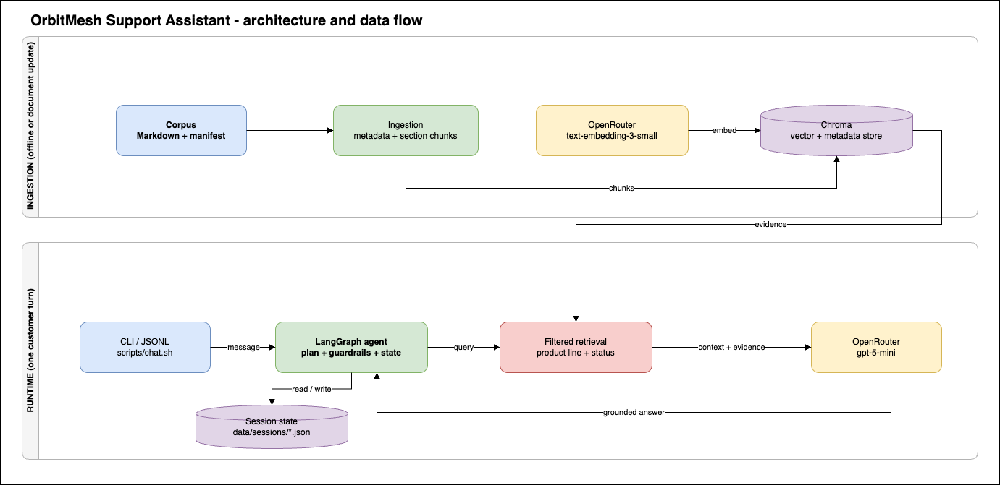
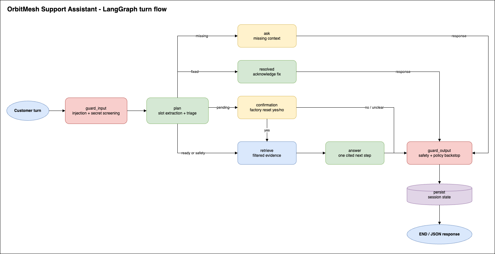

# OrbitMesh Support Assistant Design Note

## 1. Architecture and Key Trade-offs

Four layers: **ingestion** (loads corpus, extracts metadata, chunks, embeds, stores in Chroma), **retrieval** (filters by product line/status, then ranks by similarity), **conversation agent** (LangGraph: screens input, fills diagnostic slots, retrieves evidence, generates a cited answer, applies guardrails, persists session), and **CLI** (interactive terminal + JSONL adapter).

Key trade-off: the LLM handles triage and wording, but never product facts directly — retrieval filters and deterministic guardrails control what evidence and actions are allowed. This sacrifices some flexibility for grounding and safety.

Second trade-off: local simplicity (Chroma + JSON session files) vs. production scale. Easy to run and inspect locally; would need managed services and shared storage for multiple production instances.



## 2. Chunking and Embedding Choices

Documents split at Markdown heading boundaries (`##`/`###`) rather than by character count — e.g. `Wireless N1` and `Ethernet-connected N1` become separate chunks, each retaining its parent heading for context. This matches the corpus's existing structure and avoids mixing incompatible instructions in one embedding; a long section might still need a secondary length-based split at larger scale.

Each chunk carries metadata: document ID/section, product line (`home`/`pro`/`all`), current/archive status, version, effective date.

Embeddings: OpenRouter `openai/text-embedding-3-small`. Chat: `openai/gpt-5-mini`. Separating the two keeps semantic search independent from answer generation. Retrieval filters metadata **before** ranking by similarity — this avoids generic-similarity mistakes (e.g. returning the home LED reference for a Pro N5 Pro question) but requires the agent to establish product line first.

## 3. Conversation and Safety Design

The LangGraph planner tracks product line, device, symptom, connection method, LED state, error code, and attempted steps, asking one focused question when context is missing. The answer node receives only relevant evidence and must return an action, citations, and one safe next step. Sessions persist under `data/sessions/`, so a reused JSONL `session_id` continues the conversation.

Guardrails run before and after the LLM: input checks catch prompt-injection language and redact secrets; output checks block internal-repair instructions, require confirmation before a factory reset, add warranty disclaimers, and force escalation for safety conditions (smoke, burning smell, overheating, visible damage).

## 4. Evaluation Method and Results

Evaluated through the real JSONL interface (not internal function calls) — Promptfoo drives `scripts/chat.sh --jsonl` via `promptfoo/provider.js`, preserving `session_id` across multi-turn cases. `make test` runs the smoke suite; `make eval` runs the full suite covering Home vs. Pro retrieval/citations, diagnostic memory, factory-reset confirmation, safety escalation, prompt injection, and resolution recognition.

Observed live results:

```text
make test: 2/2 passed
make eval: 6/6 passed
contract checker: 20/20 checks passed
```

Assertions check observable behavior — allowed actions, expected/forbidden citations, safety escalation, no unsafe advice — not that every sentence is factually perfect.

GitHub Actions uses `ORBITMESH_CI_MODE=1` (local Chroma embeddings + deterministic LLM responses) to run ingestion, retrieval, idempotency, contract, and Promptfoo checks with no API key — validating wiring, not live model quality.

## 5. Observed Failure and Fix

Early on, the planner could correctly flag a safety signal, but the graph still let the answer model choose the final action — so a burning-smell report could theoretically get an ordinary troubleshooting step instead of escalation. An offline evaluation case exposed this. Fix: `node_guard_output` now forces `action="escalate"` whenever the planner reports a safety signal, appending a stop-and-contact-support message. The LLM still handles language/evidence; it can no longer override a safety stop condition.

## 6. Scaling to 100x Corpus and Real Load

Ingestion should become a versioned batch job: batched/cached embeddings, incremental updates, atomic index publishing. A managed vector database replaces the single local Chroma directory for concurrent access. Retrieval needs stronger deduplication, reranking, and conflict resolution as overlapping/contradictory procedures become more likely.

For real traffic: move sessions to shared storage, add connection pooling, retrieval/response caches, timeouts, rate limits, tracing, and monitoring. Since the planner adds a model call every turn, a smaller/deterministic classifier could replace it, reserving the larger model for grounded answers.

## 7. How the Evaluation Could Be Misleading

The suite is small and hand-written — it could pass while missing a private conversation combining an ambiguous product, an archived-firmware workaround, incomplete LED info, and a safety concern. Assertions check selected citations/phrases, not every claim, so results indicate regression resistance, not complete support-quality guarantees.

## 8. AI Tools Used and Human Review

GitHub Copilot (VS Code) assisted with exploring the repo, comparing structures, drafting Python/LangGraph code, and debugging Promptfoo/OpenRouter integration. The work stayed human-in-the-loop: I chose the architecture, reviewed suggestions, checked behavior/safety rules against the actual corpus, ran commands, and decided which fixes to keep. Promptfoo was the black-box eval tool; OpenRouter supplied embedding/chat APIs. Copilot accelerated exploration and coding — final design decisions and validation were mine.



